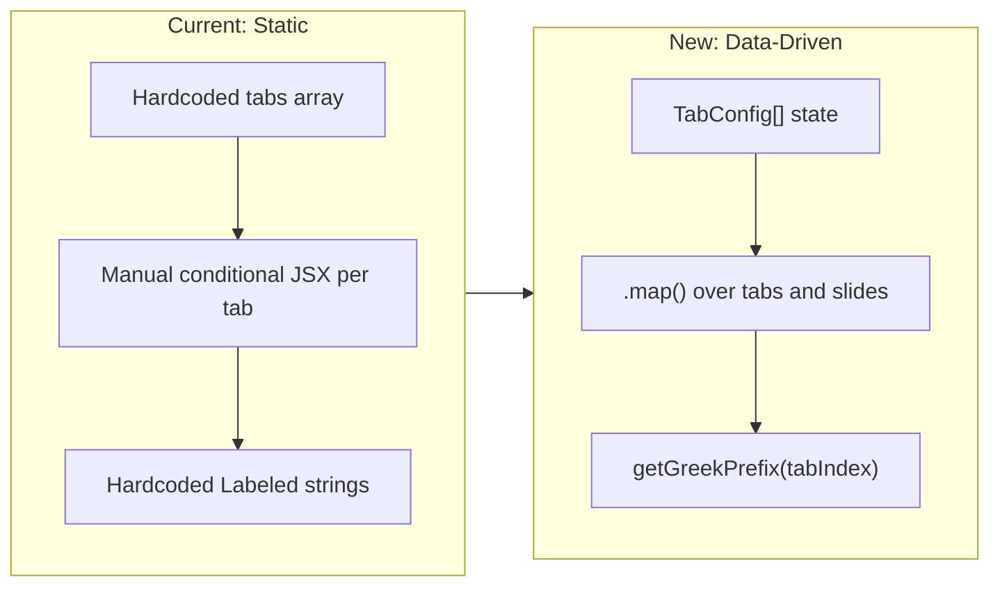

# Dynamic Tab Add / Delete System

## Current State

`[app/components/DeckShell.tsx](app/components/DeckShell.tsx)` has:

- A **hardcoded** `tabs` array of `{ id, label }` objects (4 tabs)
- 10 section component imports, each **manually placed** inside `activeTab === "..."` conditional blocks
- Greek-letter labels (`Alpha-1`, `Beta-2`, ...) written as **string literals** in `<Labeled>` wrappers

This means adding or removing a tab requires editing source code in multiple places.

---

## Architecture Change

Transform the tab system from static JSX to a **data-driven registry** where each tab carries its own slide component list. This enables runtime add/delete without code changes.




---

## Deletion Rule

- **Hard floor:** minimum 2 tabs must always exist
- **Delete enabled:** when `tabs.length > 2` (i.e., 3+ tabs present)
- **Any tab** can be deleted (no tab is permanently locked) -- the constraint is purely on count
- When the active tab is deleted, navigation falls back to the first tab

---

## New Files

### 1. `app/types/deck.ts` -- Tab and slide type definitions

```typescript
import { ComponentType } from "react";

export interface TabConfig {
  id: string;
  label: string;
  slides: ComponentType[];
}
```

### 2. `app/utils/greekPrefix.ts` -- Greek letter derivation

Map a 0-based tab index to its Greek letter prefix. Supports up to 24 tabs (full Greek alphabet), with a numeric fallback beyond that.

```typescript
const GREEK = [
  "Alpha", "Beta", "Gamma", "Delta", "Epsilon", "Zeta",
  "Eta", "Theta", "Iota", "Kappa", "Lambda", "Mu",
  "Nu", "Xi", "Omicron", "Pi", "Rho", "Sigma",
  "Tau", "Upsilon", "Phi", "Chi", "Psi", "Omega",
];

export function getGreekPrefix(tabIndex: number): string {
  return GREEK[tabIndex] ?? `Tab-${tabIndex + 1}`;
}
```

### 3. `app/hooks/useTabManager.ts` -- Add/remove tab state

Manages the `TabConfig[]` state array. Provides:

- `addTab()` -- appends a new tab with 2 sample slides, returns the new tab's `id`
- `removeTab(id)` -- removes a tab by id (no-op if count would drop below 2)
- `canDelete` -- derived boolean (`tabs.length > 2`)
- `tabs` -- the current array

Internally uses `useState<TabConfig[]>` seeded from an initial config passed in. A counter ref tracks how many tabs have been added for unique id/label generation (`tab-1`, `tab-2`, ...; labels: `"New Tab 1"`, `"New Tab 2"`).

### 4. `app/components/SampleSlideA.tsx` -- Sample slide (card grid)

A placeholder slide following the full `SectionWrapper` + `SectionCard` anatomy with a heading, description, and a 2-column grid of 2 placeholder content cards using the dark card style (`bg-[#1a3d5c]`). Uses the standard color palette and typography. The `SectionWrapper` label will be "SAMPLE SECTION".

### 5. `app/components/SampleSlideB.tsx` -- Sample slide (list layout)

A placeholder slide with a heading, description, and a short list of 3 placeholder items in the light callout style (`bg-[#f0f6fc]` with border). The `SectionWrapper` label will be "SAMPLE DETAILS".

Both sample slides are stateless, props-free components identical in structure to existing slides like `[ProblemSection.tsx](app/components/ProblemSection.tsx)` and `[ImpactSection.tsx](app/components/ImpactSection.tsx)`.

---

## Modified Files

### 6. `app/components/DeckShell.tsx` -- Major refactor

Changes:

**a) Define `INITIAL_TABS` config array** replacing the current `tabs` array. Each entry carries its `slides` component list:

```typescript
const INITIAL_TABS: TabConfig[] = [
  { id: "problem", label: "Problem", slides: [ProblemSection, ProblemCondensedSection, ProblemCleanSection] },
  { id: "gap", label: "Gap", slides: [GapSection, GapVisionSection, GapVisionCondensedSection] },
  { id: "user-journey", label: "User Journey", slides: [UserJourneySection, UserJourneyCondensedSection] },
  { id: "next-steps", label: "Next Steps", slides: [ArchitectureSection, ImpactSection] },
];
```

**b) Use `useTabManager` hook** for state instead of a static array:

```typescript
const { tabs, addTab, removeTab, canDelete } = useTabManager(INITIAL_TABS);
```

**c) Replace the 4 hardcoded conditional blocks** with a single data-driven `.map()`:

```typescript
{tabs.map((tab, tabIdx) =>
  activeTab === tab.id && (
    <div key={tab.id}>
      {tab.slides.map((Slide, slideIdx) => (
        <Labeled key={slideIdx} name={`${getGreekPrefix(tabIdx)}-${slideIdx + 1}`}>
          <Slide />
        </Labeled>
      ))}
    </div>
  )
)}
```

**d) Add "+" button** at the end of the tab bar:

- Styled as a muted `+` icon matching the tab button height
- On click: calls `addTab()`, then `router.push("?tab=<newId>")` to navigate to the new tab

**e) Add "x" delete button** on each tab (conditionally visible):

- Only rendered when `canDelete` is true
- Small `x` to the right of the tab label
- On click: calls `removeTab(tab.id)`; if `tab.id === activeTab`, navigates to `?tab=${tabs[0].id}`
- Uses `e.stopPropagation()` to avoid also triggering tab switch

**f) Derive `tabIds` dynamically** from `tabs` state (via `useMemo`) instead of a static `Set`.

---

## UI Behavior Summary


| Action       | Trigger                                | Result                                                                                                                   |
| ------------ | -------------------------------------- | ------------------------------------------------------------------------------------------------------------------------ |
| Add tab      | Click `+` button in tab bar            | New tab appended with 2 sample slides, Greek prefix auto-assigned, navigates to new tab                                  |
| Delete tab   | Click `x` on a tab (only when 3+ tabs) | Tab and its slides removed, Greek prefixes recalculate for remaining tabs, falls back to first tab if active was deleted |
| Greek naming | Automatic                              | Derived from tab position at render time -- no hardcoded strings                                                         |


---

## Greek Prefix Recalculation on Delete

When a tab is deleted, all subsequent tabs shift left. Greek prefixes are **positionally derived at render time**, so they automatically update:

```
Before delete:  Problem=Alpha, Gap=Beta, Journey=Gamma, Steps=Delta
Delete "Gap":   Problem=Alpha, Journey=Beta, Steps=Gamma
```

This matches the convention in `[GUIDE.md](GUIDE.md)`: "The prefix is determined by the tab position (1st tab = Alpha, 2nd = Beta, etc.), not by the tab's content or name."

---

## What This Does NOT Include

- **Persistence**: Tab additions/deletions are in-memory only. Refreshing the page resets to the 4 default tabs. (Future: localStorage or backend persistence)
- **Tab renaming**: Tab labels are not editable inline (could be added later)
- **Slide reordering within a tab**: Not in scope
- **Confirmation dialog on delete**: Not included for simplicity -- deletion is instant

---

## File Impact Summary


| File                              | Action   | Est. LOC             |
| --------------------------------- | -------- | -------------------- |
| `app/types/deck.ts`               | Create   | ~8                   |
| `app/utils/greekPrefix.ts`        | Create   | ~15                  |
| `app/hooks/useTabManager.ts`      | Create   | ~50                  |
| `app/components/SampleSlideA.tsx` | Create   | ~45                  |
| `app/components/SampleSlideB.tsx` | Create   | ~45                  |
| `app/components/DeckShell.tsx`    | Refactor | ~130 (down from 137) |
| `GUIDE.md`                        | Update   | Minor additions      |


