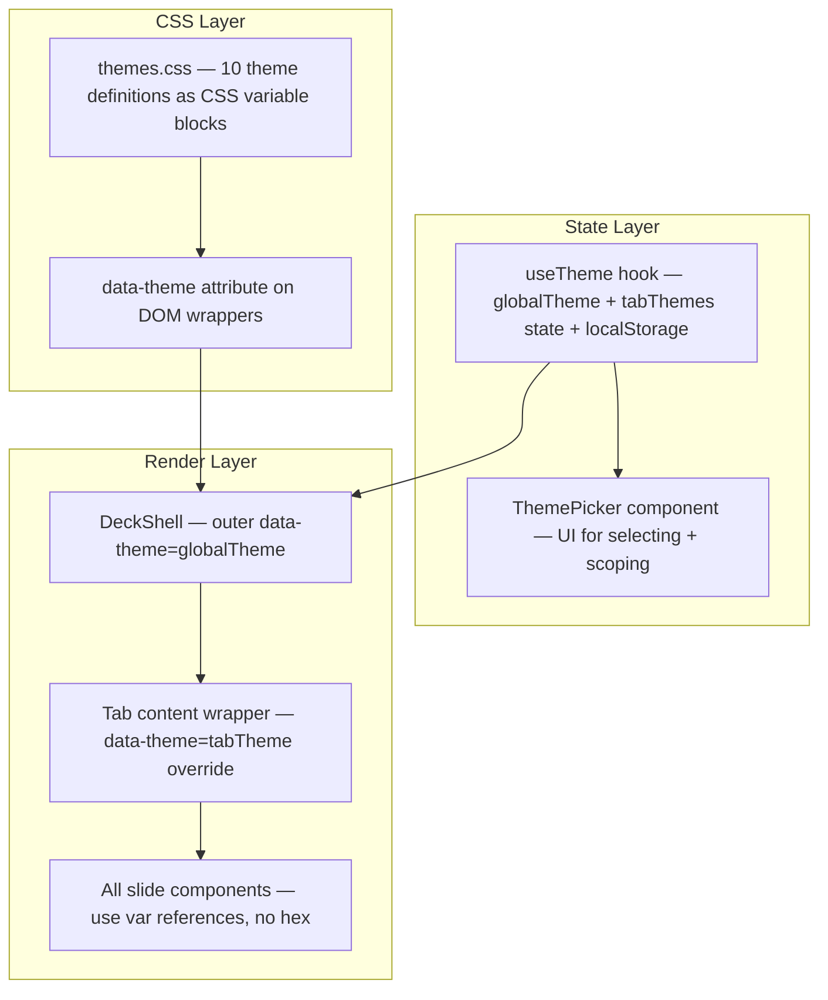
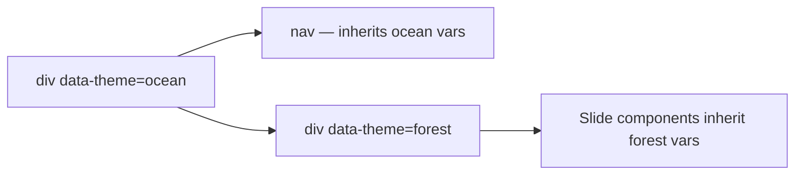

# Multi-Theme System with Per-Tab Control

## Architecture

The theming system uses **CSS custom properties** scoped via `data-theme` attributes. This means theme switching is instant (no React re-render of slide content), per-tab scoping works via CSS cascade, and all components stay theme-agnostic.




### How per-tab theming works via CSS cascade




The outer wrapper sets the global theme. If a tab has its own theme, its content wrapper gets a `data-theme` override. CSS variables cascade, so the inner attribute wins for that tab's slides while the nav/header keep the global theme.

---

## 13 Semantic Color Tokens

Every hardcoded hex maps to one of these CSS variables. Components will use Tailwind arbitrary values like `text-[var(--t-heading)]`.


| Token        | CSS Variable       | Current (Ocean) hex | Usage                                     |
| ------------ | ------------------ | ------------------- | ----------------------------------------- |
| Heading      | `--t-heading`      | `#0f2a45`           | Primary heading/body text                 |
| Dark BG      | `--t-dark`         | `#1a3d5c`           | Dark card backgrounds, pill               |
| Accent       | `--t-accent`       | `#2a6496`           | Highlighted text, badges, underline       |
| Label        | `--t-label`        | `#4a7a9e`           | Subheadings, CTAs, icon tint              |
| Muted Text   | `--t-muted`        | `#6b8eae`           | Descriptions, secondary copy              |
| Inactive     | `--t-inactive`     | `#8aa0b8`           | Inactive tab text                         |
| Icon         | `--t-icon`         | `#94b0c8`           | Icons, subtle decorative elements         |
| Border       | `--t-border`       | `#c0d4ea`           | Inner borders, dividers, card borders     |
| Card BG      | `--t-card`         | `#eaf1f8`           | SectionCard background                    |
| Callout BG   | `--t-callout`      | `#f0f6fc`           | Highlighted callout panel background      |
| Border Outer | `--t-border-outer` | `#d5e1ed`           | SectionWrapper border, header/nav borders |
| On Dark      | `--t-on-dark`      | `#ffffff`           | Text on dark backgrounds                  |
| On Dark Soft | `--t-on-dark-soft` | `#bfdbfe`           | Secondary text on dark backgrounds        |


**Not themed** (semantic, not aesthetic): `text-red-400` in NegationList (negation = always red).

---

## 10 Themes

Each theme is a cohesive palette following the same 13-token structure, tuned so dark cards have sufficient contrast and text remains readable.

1. **Ocean** — current blue-navy (default)
2. **Forest** — deep greens, moss, sage
3. **Sunset** — warm amber, burnt orange, terracotta
4. **Lavender** — violet, purple, soft lilac
5. **Slate** — cool neutral grays with steel-blue tint
6. **Rose** — pink, magenta, berry tones
7. **Ember** — deep red, warm brown, copper
8. **Teal** — cyan, dark teal, seafoam
9. **Sand** — warm beige, olive, earth tones
10. **Midnight** — deep indigo, electric blue accents

---

## New Files

### `app/themes.css` (~180 LOC)

All 10 `[data-theme="<name>"]` blocks, each setting the 13 CSS variables. Imported by `globals.css`. The `:root` block doubles as the `ocean` default.

### `app/constants/themes.ts` (~40 LOC)

Theme metadata for the picker UI:

```ts
export const THEMES = [
  { id: "ocean", name: "Ocean", swatch: "#1a3d5c" },
  { id: "forest", name: "Forest", swatch: "#2d4a2d" },
  // ...
] as const;
```

### `app/hooks/useTheme.ts` (~50 LOC)

Custom hook managing:

- `globalTheme: string` — default theme for all tabs
- `tabThemes: Record<string, string>` — per-tab overrides
- `getTabTheme(tabId)` — returns effective theme for a tab
- `applyTheme(themeId, scope: "all" | tabId)` — sets theme globally or per-tab
- Persists to `localStorage` on every change; reads on mount

### `app/components/ThemePicker.tsx` (~120 LOC)

UI component:

- Trigger: a palette icon button in the header bar
- Opens a popover panel showing 10 theme swatches (colored circles)
- Below the swatches: radio toggle — "Apply to All Tabs" vs "Apply to Current Tab"
- "Apply" button that calls `applyTheme()`
- Clicking a swatch selects it (highlighted border); clicking Apply confirms

---

## Modified Files

### `app/globals.css`

- Add `@import "./themes.css";`
- Remove the hardcoded `--foreground: #0f2a45` (replaced by `--t-heading`)

### `app/components/shared.tsx`

Replace all hardcoded hex with CSS variable references:

- `border-[#d5e1ed]` becomes `border-[var(--t-border-outer)]`
- `text-[#0f2a45]` becomes `text-[var(--t-heading)]`
- `bg-[#eaf1f8]` becomes `bg-[var(--t-card)]`
- `border-[#c0d4ea]` becomes `border-[var(--t-border)]`

### `app/components/DeckShell.tsx`

- Import and call `useTheme` hook
- Import `ThemePicker` component
- Add `data-theme={globalTheme}` on outermost wrapper div
- Add `data-theme={getTabTheme(activeTab)}` on the tab content `<main>` wrapper
- Replace all inline hex values with CSS variable references
- Add ThemePicker to the header bar

### All 10 slide components

Each file: find-and-replace every hex with its CSS variable counterpart. Mapping:

- `#0f2a45` -> `var(--t-heading)`
- `#1a3d5c` -> `var(--t-dark)`
- `#2a6496` -> `var(--t-accent)`
- `#4a7a9e` -> `var(--t-label)`
- `#6b8eae` -> `var(--t-muted)`
- `#8aa0b8` -> `var(--t-inactive)`
- `#94b0c8` -> `var(--t-icon)`
- `#c0d4ea` -> `var(--t-border)`
- `#eaf1f8` -> `var(--t-card)`
- `#f0f6fc` -> `var(--t-callout)`
- `#d5e1ed` -> `var(--t-border-outer)`
- `text-white` (on dark cards) -> `text-[var(--t-on-dark)]`
- `text-blue-200` (on dark cards) -> `text-[var(--t-on-dark-soft)]`

Files: `ProblemSection.tsx`, `ProblemCondensedSection.tsx`, `ProblemCleanSection.tsx`, `GapSection.tsx`, `GapVisionSection.tsx`, `GapVisionCondensedSection.tsx`, `UserJourneySection.tsx`, `UserJourneyCondensedSection.tsx`, `ArchitectureSection.tsx`, `ImpactSection.tsx`

### `GUIDE.md`

- Update Color Palette section: document the CSS variable system and the 10 themes
- Note that components must use `var(--t-*)` references, never raw hex values

### `DEV_GUIDE.md`

- Add a **Theming Rule** section:
  - Never use hardcoded color hex — always reference `var(--t-*)` tokens
  - Add new theme: create a `[data-theme="name"]` block in `themes.css` + entry in `THEMES` array
  - Per-tab scoping works via CSS cascade, no prop drilling needed
- Update the DRY checklist to include "No raw hex color values in components"
- Add to Quick Reference table

### `AGENTS.md`

- Add a rule: "Never use raw hex color values in components. Always use CSS variable tokens from `themes.css`."

---

## Execution Order

The work follows a dependency chain: CSS variables must exist before components can reference them, and the hook must exist before DeckShell can use it.